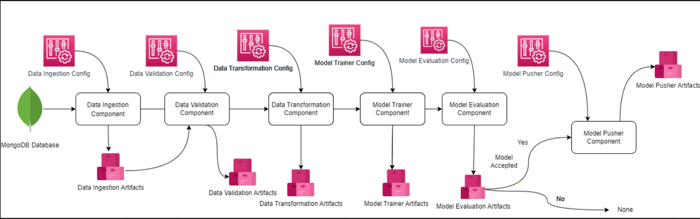
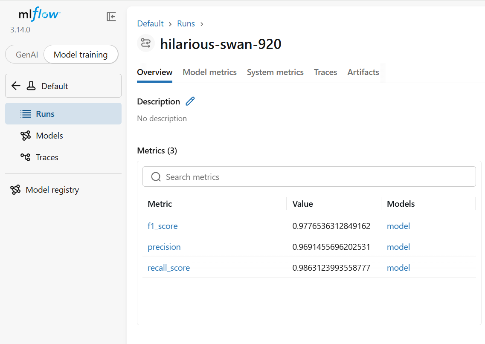
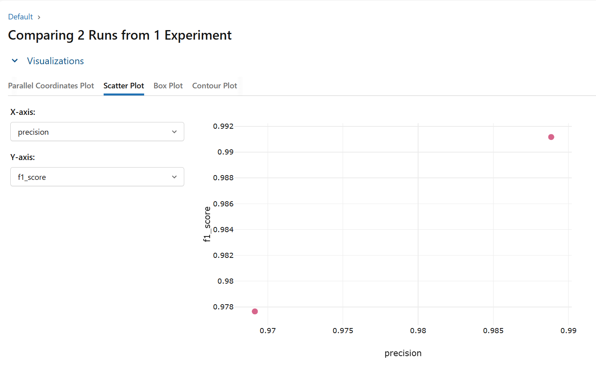

<div align="center">

# 🛡️ Network Security
### Phishing Website Detection using an End-to-End Machine Learning Pipeline

An end-to-end Machine Learning project that detects phishing websites through a modular training pipeline, experiment tracking with MLflow, MongoDB-based data ingestion, and FastAPI deployment.

<p>


</p>

</div>

---

# 📌 Overview

Traditional machine learning projects often end after training a model inside a notebook.

This project demonstrates what happens **after** model development by implementing a production-inspired machine learning pipeline that automates every major stage of the ML lifecycle—from data ingestion to deployment.

The system predicts whether a website is **Legitimate** or **Phishing** using engineered website features while maintaining a clean, modular architecture suitable for real-world ML applications.

---

# ✨ Features

- End-to-End Machine Learning Pipeline
- MongoDB Data Ingestion
- Automated Data Validation
- Data Transformation Pipeline
- Model Training & Selection
- MLflow Experiment Tracking
- FastAPI REST API
- Batch Prediction using CSV Upload
- Modular Project Architecture
- Centralized Logging & Exception Handling

---

# 🏗️ System Architecture

The complete workflow of the application is illustrated below.

<p align="center">

</p>

### Pipeline Flow

```text
MongoDB
   │
   ▼
Data Ingestion
   │
   ▼
Data Validation
   │
   ▼
Data Transformation
   │
   ▼
Model Training
   │
   ▼
Model Evaluation (MLflow)
   │
   ▼
Model Pusher
   │
   ▼
FastAPI Prediction Service
```

---

# ⚙️ Project Workflow

### 1. Data Ingestion

- Connects to MongoDB
- Retrieves phishing dataset
- Creates training and testing datasets

---

### 2. Data Validation

- Verifies dataset schema
- Checks feature consistency
- Prevents invalid data from entering the pipeline

---

### 3. Data Transformation

- Applies preprocessing pipeline
- Generates transformed datasets
- Saves reusable preprocessing object

---

### 4. Model Training

- Trains candidate machine learning models
- Compares model performance
- Selects the best performing model

---

### 5. Model Evaluation

The trained model is evaluated and every experiment is tracked using **MLflow**.

Logged information includes:

- Precision
- Recall
- F1 Score
- Model Artifacts
- Experiment History

---

### 6. Model Deployment

The selected model and preprocessing pipeline are serialized and used by the FastAPI application for prediction.

---

# 📊 Experiment Tracking with MLflow

Instead of printing metrics to the console, every training run is logged using **MLflow**, making experiments reproducible and easy to compare.

## Model Metrics

<p align="center">

</p>

The metrics page stores evaluation results such as Precision, Recall, and F1 Score for every trained model.

---

## Experiment Comparison

<p align="center">

</p>

MLflow allows side-by-side comparison of multiple training runs, making it easier to identify the best-performing model before deployment.

---

# 📂 Project Structure

```text
ML2/
│
├── app.py
├── main.py
├── requirements.txt
│
├── networksecurity/
│   ├── components/
│   ├── configuration/
│   ├── entity/
│   ├── pipeline/
│   ├── utils/
│   ├── logging/
│   ├── exception/
│   └── constant/
│
├── templates/
│
├── valid_data/
│
└── Network_Data/
```

---

# 🚀 Installation

Clone the repository

```bash
git clone https://github.com/yourusername/network-security.git

cd network-security
```

Create a virtual environment

```bash
conda create -n networksecurity python=3.10
```

Activate the environment

```bash
conda activate networksecurity
```

Install dependencies

```bash
pip install -r requirements.txt
```

---

# ▶️ Run the Application

```bash
uvicorn app:app --reload
```

Once the server starts, open:

```
http://127.0.0.1:8000
```

---

# 📡 API

### Train Model

Starts the complete training pipeline.

```
POST /train
```

---

### Predict

Upload a CSV file and generate phishing predictions.

```
POST /predict
```

---

# 🛠️ Tech Stack

### Programming Language

- Python

### Machine Learning

- Scikit-Learn
- Pandas
- NumPy

### Backend

- FastAPI

### Database

- MongoDB

### Experiment Tracking

- MLflow

### Other Tools

- Uvicorn
- Jinja2
- Git

---

# 🎯 Highlights

- Production-inspired ML architecture
- End-to-end automated pipeline
- Experiment tracking with MLflow
- REST API deployment using FastAPI
- MongoDB-based dataset management
- Batch prediction support
- Modular and maintainable codebase

---

# 🔮 Future Improvements

- Docker support
- CI/CD pipeline
- Cloud deployment
- Model monitoring
- Authentication & Authorization
- Automated retraining pipeline

---

# 👨‍💻 Author

**Om Vaghani**

Computer Science Engineering Student

Passionate about Machine Learning, Generative AI, LLMs, RAG Systems, and Production AI Engineering.

---

⭐ If you found this project useful, consider giving it a star.